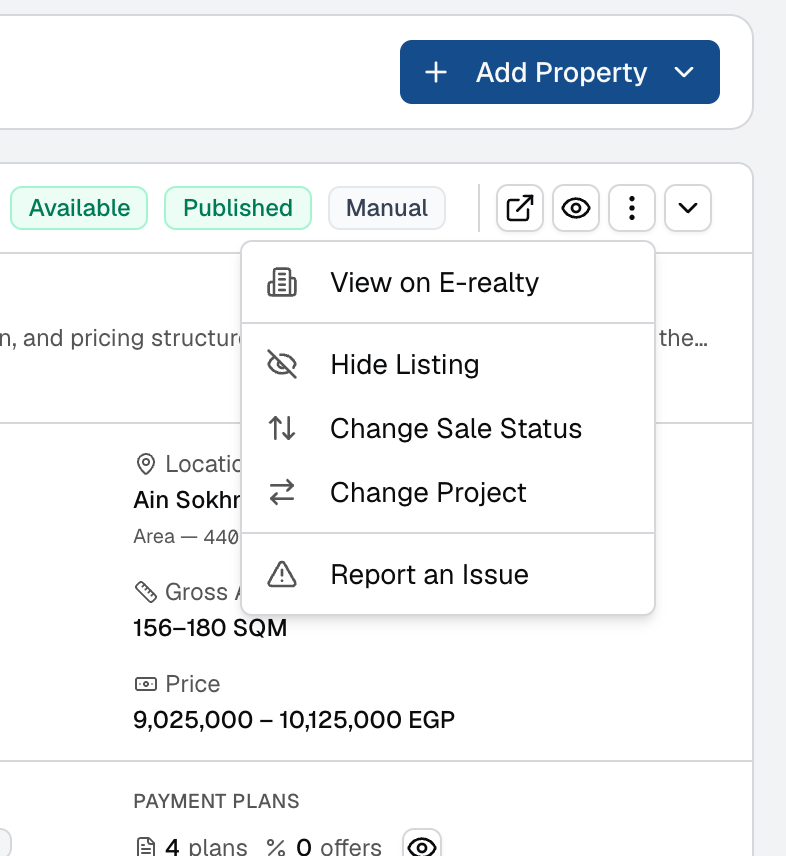
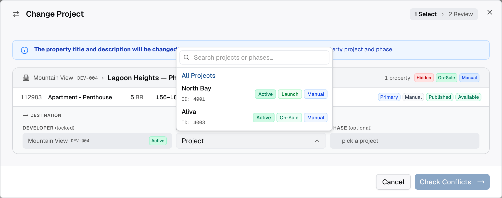
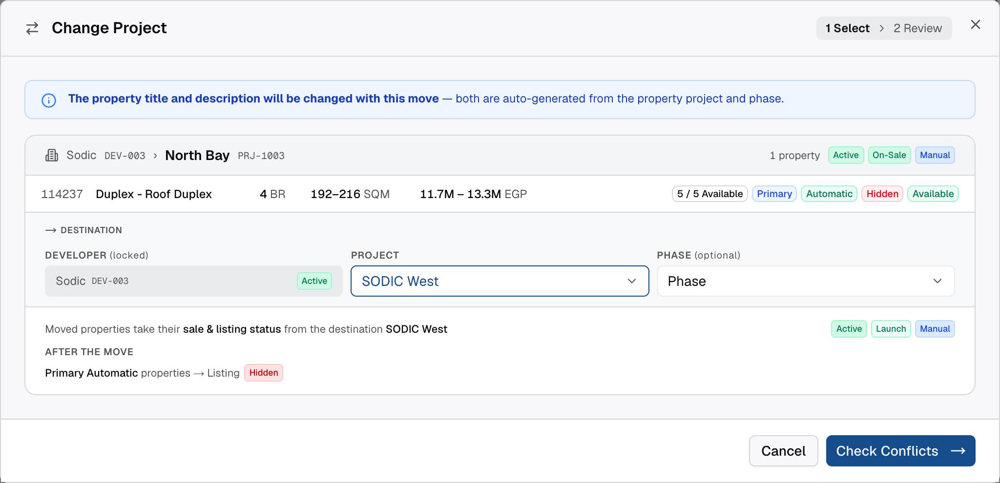
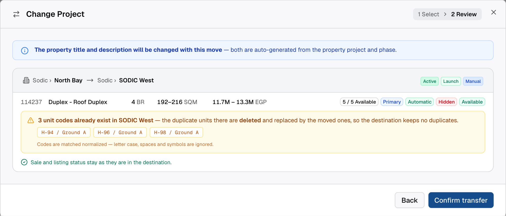
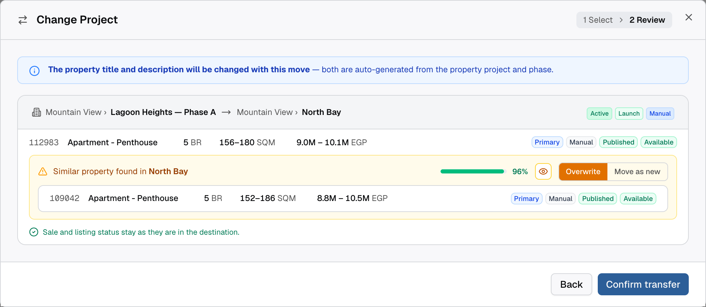
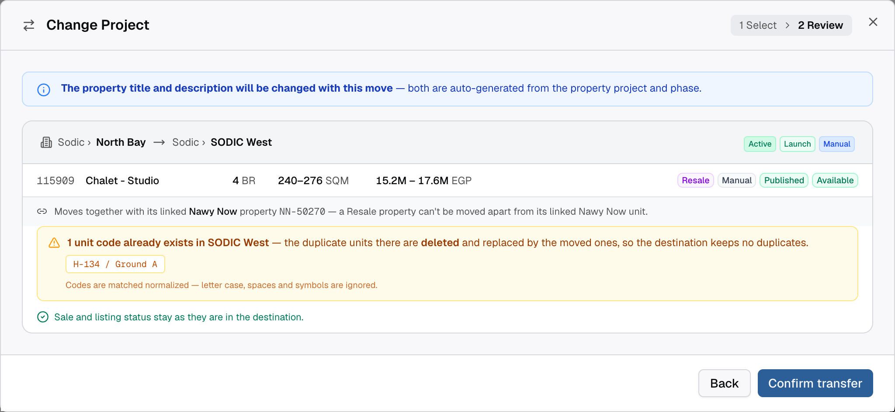
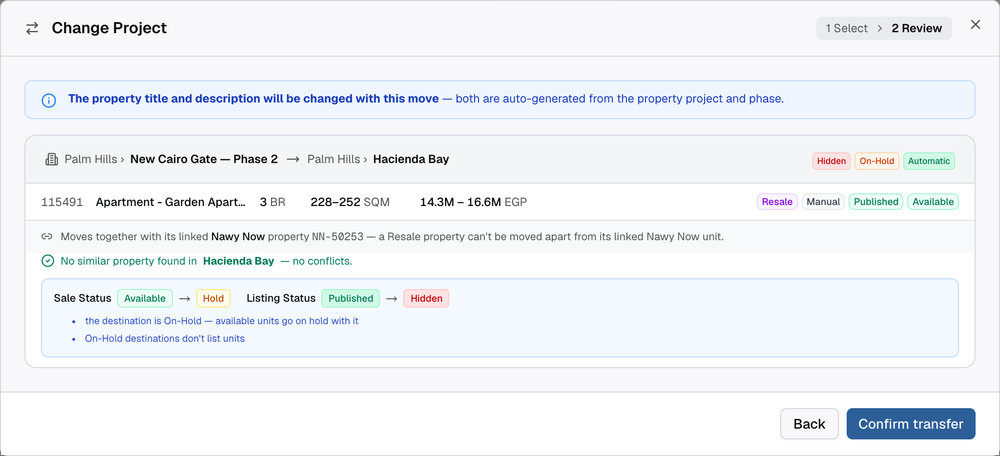
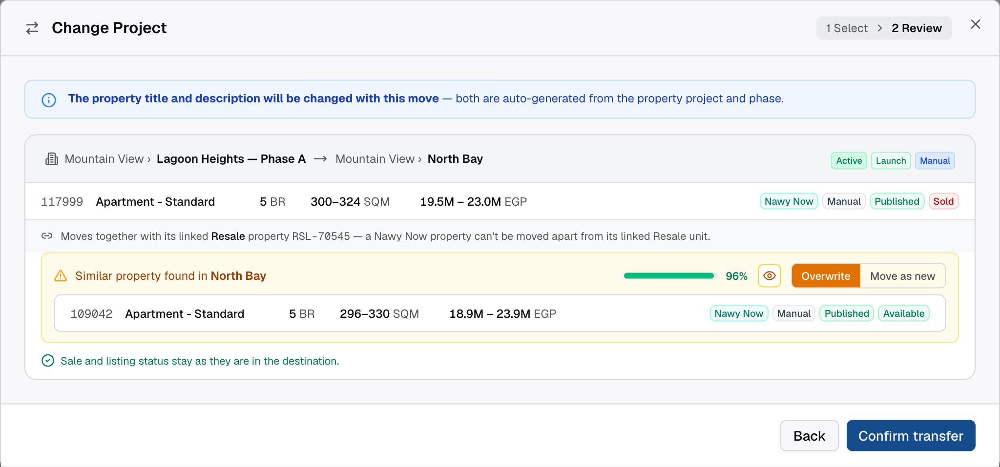
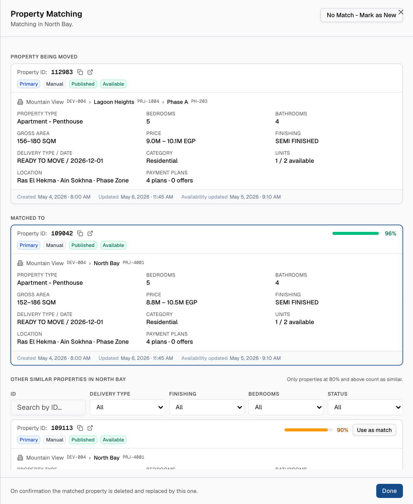
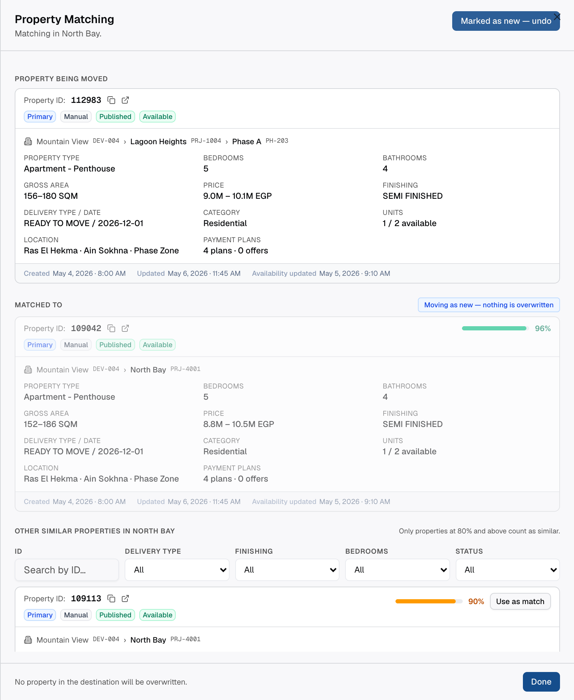

# Change Project — Move a Property to Another Project

## 1. Objective

Properties are regularly created under the wrong project or phase, and today the only way out is deleting and
re-creating them. `Change Project` moves one grouped property — with all its detailed units — to another project
or phase of the **same developer**, checking first whether the destination already holds the same unit so we never
create duplicates, and showing the user what the destination will do to the property's sale and listing status
before anything is applied.

---

## 2. Requirements

### 2.1 Entry Point

1. Properties → `All Properties` / `Primary Properties` / `Resale Properties` / `Nawy Now Properties`, in the
   `Grouped Properties` view → the property card's `⋯` menu → **`Change Project`**.
2. The same item exists in the `⋯` menu of the grouped property details header, with identical behaviour.
3. The action is per record. Bulk `Change Project` from the selection bar is a separate story and is not covered here.

### 2.2 Sale Types That Have This Action

| Sale type | Action shown | Matching done by |
| --- | --- | --- |
| Primary — Entry Type `Automatic` | `Change Project` | Unit code (exact, normalized) |
| Primary — Entry Type `Manual` | `Change Project` | Similarity comparison |
| Resale (Entry Type is always `Manual`) | `Change Project` | Unit code when the property has one, otherwise similarity |
| Nawy Now (Entry Type is always `Manual`) | `Change Project` | Unit code when the property has one, otherwise similarity |
| Launch | `Change Linked Launch` instead | — (the property follows its launch) |
| Rental | No move action | — |

1. Entry Type is a property attribute and is **never changed** by the move.
2. For Resale and Nawy Now, Entry Type says nothing about the unit code — some carry one, some don't. The
   **presence of a unit code on the record**, not the sale type, decides which matching path runs.
3. A property whose unit codes are all system placeholders (`TMP-…`) counts as having no unit code.

### 2.3 Step 1 — Select Destination

1. The dialog is `Change Project` with two steps in the header: `1 Select` → `2 Review`.
2. A disclaimer sits above everything, on both steps:
   **"The property title and description will be changed with this move — both are auto-generated from the
   property project and phase."**
3. The source line shows `Developer › Project — Phase` with their IDs, and the property row (ID, type, bedrooms,
   area range, price range, available/total units, sale type, entry type, listing status, sale status).
4. Destination fields:
   1. `Developer` — **locked** to the source developer, shown read-only with its ID and listing status tag. A
      property never moves across developers.
   2. `Project` — the shared project picker (`ProjectTreeSelect`): searchable, ID as caption, and each row shows
      its three tags — listing status, primary status, entry type. The **source project is excluded** from the
      list so the destination can never equal the source.
   3. `Phase` — optional, and only selectable after a project is picked (until then it reads `— pick a project`).
      It lists the phases of the chosen project only, with the same ID caption and three tags.
5. Once a destination is picked, its three tags are shown on the destination line so the user sees what they are
   moving into before checking.
6. `Check Conflicts` is disabled until a project is picked; `Cancel` closes without changes.

### 2.4 Step 2 — Review: Destination Effects (all sale types)

1. The review shows `source developer › project — phase → destination developer › project — phase` and the
   destination's three tags.
2. Under the property, an **After the move** block lists only what changes, as `Status before → Status after`,
   each with the reason. Rules, applied in this order:
   1. Destination primary status `Sold-Off` → sale status `Available`/`Hold` becomes `Sold`; listing `Published`
      becomes `Hidden`.
   2. Destination primary status `On-Hold` → sale status `Available` becomes `Hold`; listing `Published` becomes
      `Hidden`.
   3. Destination project (or phase) listing status `Hidden` → listing `Published` becomes `Hidden`.
   4. **Primary only** — destination entry type differs from the property's entry type → listing `Published`
      becomes `Hidden` (a project lists one entry type and hides the other).
   5. Sale status is never raised: moving a `Sold` unit into an `On-Sale` project leaves it `Sold`.
   6. Entry type, price, area, type and unit data are never changed by the move.
3. When nothing changes, the block is replaced by **"Sale and listing status stay as they are in the destination."**
4. Footer: `Back` returns to step 1 with the destination kept; `Confirm transfer` applies the move.

### 2.5 Matching — Primary, Entry Type Automatic (unit code)

1. Every unit code of the moved property is compared against the destination.
2. Comparison is **normalized**: lower-cased, trimmed, and all spaces and symbols removed — `H-116 / Ground A`
   and `h116groundA` are the same code.
3. Scope: when a phase is chosen, codes are matched against **that phase and its parent project**; when only a
   project is chosen, against the project and all of its phases.
4. Any code that already exists in the destination is a **duplicate**: on confirmation the destination's duplicate
   **detailed property is deleted** and the moved unit takes its place, so the destination is never left with two
   units of the same code. The destination's property and property metadata are untouched — the match is at unit
   level. The clashing codes are listed in the review, with the note that matching is normalized.
5. There is no choice to make here — an exact code match is an identity match, so no `Move as new` option is
   offered for this path.
6. When no code clashes, the review states there is no conflict.

### 2.6 Matching — Primary, Entry Type Manual (similarity)

1. The property has no unit code, so the destination is searched with the **similarity comparison logic already
   implemented in the comparison step of the manual ingestion flow** — same attributes, same scoring, no new model.
2. The result is a confidence percentage shown as a progress bar next to the matched property.
3. **Cut-off: 80%.** A candidate at 80% or above is treated as the same unit; anything below is not similar and is
   not surfaced at all. When nothing reaches 80%, the review states no similar property was found and the move
   carries no conflict.
4. When a match is found the user picks one of two outcomes, `Overwrite` (default) or `Move as new`:
   1. `Overwrite` — the matched destination property is replaced by the moved one: its **detailed property,
      property and property metadata are deleted** as a duplicate, and the moved property takes its place.
   2. `Move as new` — nothing in the destination is touched; the property lands as a new record.
5. `View matching details` on the confidence bar opens the matching drawer (2.8).

### 2.7 Matching — Resale and Nawy Now

1. The path is decided per record: **with a unit code → 2.5 (exact, normalized)**; **without one → 2.6 (similarity,
   80% cut-off)**. Entry Type plays no part.
2. **Linked units.** A Resale property listed on Nawy Now, and the Nawy Now property it was listed from, are two
   records of one physical unit:
   1. The review states it explicitly: *"Moves together with its linked Nawy Now property NN-XXXXX — a Resale
      property can't be moved apart from its linked Nawy Now unit."* (and the mirror wording on a Nawy Now
      property, naming its linked Resale property).
   2. Confirming the move moves **both records** to the same destination. The linked unit is not listed as a
      separate row to act on, and it cannot be excluded.
   3. If the matched destination property is itself linked, overwriting deletes **both** the matched property and
      its counterpart (each with its detailed property and property metadata) — stated in the drawer footer.
   4. The counterpart ID is shown on every card in the drawer as `Linked to: NN-XXXXX (Nawy Now)` /
      `Linked to: RSL-XXXXX (Resale)`, opening that record in a new tab.

### 2.8 Property Matching Drawer (similarity path only)

1. Opened from `View matching details` on the confidence bar. Header: `Property Matching`, subtitle
   `Matching in {destination}`.
2. Top-right action **`No Match - Mark as New`** — the user's statement that this is a different unit. While it is
   on: the matched card is muted, a `Moving as new — nothing is overwritten` badge is shown, the button becomes
   `Marked as new — undo`, and the footer reads that nothing in the destination will be overwritten.
3. Three sections:
   1. `Property being moved` — the source property, plus the linked-unit line when it has a counterpart.
   2. `Matched to` — the current match with its confidence.
   3. `Other similar properties in {destination}` — every other candidate **at 80% and above**, each with its
      confidence and a `Use as match` button that makes it the match (and resets the decision to `Overwrite`).
      The rule is stated in the section: *"Only properties at 80% and above count as similar."*
4. Candidate filters: `ID` search, `Delivery type`, `Finishing`, `Bedrooms`, `Status`. With no result:
   "No property matches these filters."; with no candidates at all: "No other similar property in this destination."
5. Every property card carries: `Property ID` with copy and open-in-new-tab, `Linked to: …` when linked, the sale
   type / entry type / listing status / sale status tags, the confidence bar, the destination path
   (`Developer DEV-00X › Project PRJ-XXXX › Phase PH-XXX`), the field grid (type, bedrooms, bathrooms, gross area,
   price, finishing, delivery type and date, category, units, location, payment plans) and a footer with
   `Created`, `Updated` and `Availability updated`.
6. `Done` closes the drawer and keeps the chosen outcome on the review card.

### 2.9 Confirm

1. `Confirm transfer` applies: the property (and its linked counterpart) moves to the destination project/phase,
   title and description are regenerated, the sale and listing status changes of 2.4 are applied, and every
   overwrite decided in the review is executed.
2. A completion screen states how many grouped properties and detailed units moved, and lists each
   `source → destination` line. `Done` closes the dialog and the table reflects the new project immediately.

### 2.10 Backend / data

1. Unit-code comparison is normalized (`lower → trim → strip every non-alphanumeric character`) on both sides
   before comparing; the stored unit code itself is not rewritten.
2. Similarity uses the existing manual-ingestion comparison service; this story does not introduce a new algorithm.
   The 80% threshold is **hard-coded** — no setting, no per-sale-type override.
3. Overwriting **deletes** the duplicate in the destination; the moved record is not merged into it:
   1. Unit-code path (Primary Automatic) — delete the duplicate **detailed property** only.
   2. Similarity path (Primary Manual, Resale, Nawy Now) — delete the duplicate **detailed property, property and
      property metadata**.
   3. A linked Resale ⇄ Nawy Now duplicate is deleted on both sides, each with its own records.
   4. Deleted IDs are gone: anything holding the destination record's ID (external links, cached listings) must be
      refreshed — the moved property keeps its own ID.
4. Title and description regeneration reuses the existing auto-generation used at creation.
5. The move is one transaction: the property, its detailed units and its linked counterpart all move or none do.

---

## 3. References

- IMS prototype: https://ims-nawy.vercel.app/ → Properties → Primary / Resale / Nawy Now Properties →
  `Grouped Properties` → card `⋯` → `Change Project`
- Screenshots: `2026-09-28-change-project-single-record/` (referenced inline above)

---

## 4. Testing

### Acceptance criteria

- [ ] On a Primary, Resale or Nawy Now property card, the `⋯` menu shows `Change Project`; on a Launch property it
      shows `Change Linked Launch`; on a Rental property neither appears.
- [ ] In step 1 the developer is locked to the source developer, and the source project is not in the project list.
- [ ] `Phase` cannot be opened before a project is picked, and only lists phases of the chosen project.
- [ ] The project and phase rows each show ID, listing status, primary status and entry type; the picked
      destination's three tags appear on the destination line.
- [ ] The title-and-description disclaimer is visible on both steps.
- [ ] Primary Automatic into a destination holding the same unit code (written differently, e.g. `h116grounda`):
      the code is listed as a duplicate and, after confirming, the destination's duplicate **detailed property** is
      deleted, its property and property metadata still exist, and the destination holds one unit for that code.
- [ ] Primary Automatic with no matching code: the review reports no conflict.
- [ ] Primary Manual with a destination twin: a confidence percentage is shown, `Overwrite` is preselected, and on
      confirming the twin's **detailed property, property and property metadata are deleted**.
- [ ] `Move as new` on the same case leaves the destination twin and all three of its records untouched.
- [ ] A candidate below 80% is not offered anywhere — not as the match and not in `Other similar properties`.
- [ ] In the drawer, `Use as match` on another candidate makes it the matched property and returns the decision to
      `Overwrite`; `No Match - Mark as New` mutes the match and the footer confirms nothing is overwritten.
- [ ] Drawer filters (ID, delivery type, finishing, bedrooms, status) narrow the candidate list, with an empty state.
- [ ] Resale **with** a unit code goes down the unit-code path; Resale **without** one goes down the similarity path.
- [ ] Moving a Resale property that is linked to a Nawy Now property moves both records; the disclaimer names the
      counterpart, and the same holds in the opposite direction.
- [ ] Moving into an `On-Hold` destination turns `Available` into `Hold` and `Published` into `Hidden`, with both
      reasons listed; into a `Sold-Off` destination, `Available` becomes `Sold` and `Published` becomes `Hidden`.
- [ ] Moving into a `Hidden` project turns `Published` into `Hidden` and changes nothing else.
- [ ] Moving a Primary `Automatic` property into a `Manual` destination (or the reverse) turns `Published` into
      `Hidden`; the property's own entry type is unchanged.
- [ ] Moving a `Sold` unit into an `On-Sale` destination leaves it `Sold`.
- [ ] After confirming, the completion screen counts the grouped properties and detailed units moved, and the
      property appears under the destination project with a regenerated title and description.
- [ ] Nothing else changed: the property cards, their other row actions and the grouped/detailed views behave as
      before.

### Considerations

- Prepare in staging: one Primary Automatic property whose unit code exists in another project of the same
  developer **written differently** (case/spacing/symbols); one Primary Manual property with a near-identical twin
  in another project; one Resale **with** a unit code and one **without**; one Resale ⇄ Nawy Now linked pair; and
  destination projects covering `On-Sale`, `On-Hold`, `Sold-Off`, `Hidden` listing, and both entry types.
- Check after each overwrite what was actually deleted: unit-code path → only the duplicate detailed property;
  similarity path → the detailed property, the property and the property metadata. Confirm no orphan property
  metadata is left behind, and that the destination holds exactly one record for the unit.
- Verify the moved property on the Website and the mobile app: a unit hidden by the move must disappear from
  listings, and titles must reflect the new project.
- Back up the properties, detailed properties and property metadata tables before the first production run — an
  overwrite deletes destination records and is not reversible from the UI.
